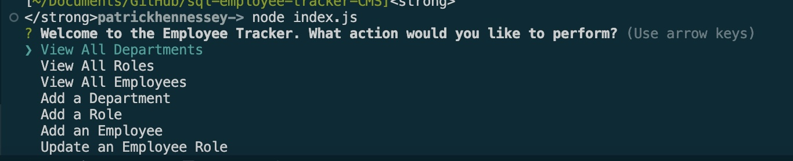

# sql-employee-tracker-CMS

## Description

A command-line application from scratch to manage a company's employee database, using Node.js, Inquirer, and PostgreSQL.

## Table of Contents
        
- [Installation](#installation)
- [Usage](#usage)
- [Credits](#credits)
- [License](#license)

## Installation

To use this application, the user must install Node.js, Inquirer, and the pg package to connect to PostgreSQL.

## Usage
        
To run the applicaton simply run `Node Index.js` into the terminal: 

https://www.youtube.com/watch?v=q-OvNFIVBT4&ab_channel=PatrickHennessey

## Credits
        
GitHub: https://github.com/RickHennessey87
Email: pjhennessey89@gmail.com

## License
    
This project is covered by the MIT License license.

[MIT License](https://opensource.org/licenses/MIT)

## How to Contribute 

No contributions needed.
        
## Tests
        
No tests to run. 